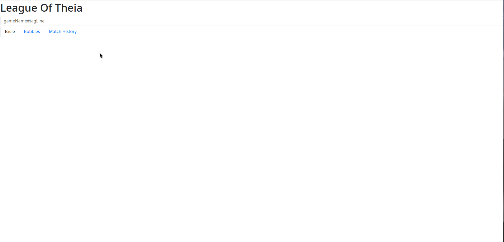

# League of Theia is a visualization tool

League of theia is a tool that helps you vizualize data about League of Legends.
It currently features mastery points and match history vizualisations.



# Quick start

To gather data about your account, you can use our fetcher script like so:
```python
./fetcher.py -k [RIOT_API_KEY] -r gameName#tagLine 
```

You can try with those accounts:
- ZeHunterZ#EUW
- N1Ghtress#Stab

Once data is successfully gathered via riot API, you can start a http server using the following command for example:
```python
python -m http.server
```
Open `http://127.0.0.1:8000/site/` in your browser to open LeagueOfTheia.

# Disclaimer 

League Of Theia isn't endorsed by Riot Games and doesn't reflect the views or opinions of Riot Games or anyone officially involved in producing or managing Riot Games properties. Riot Games, and all associated properties are trademarks or registered trademarks of Riot Games, Inc.
